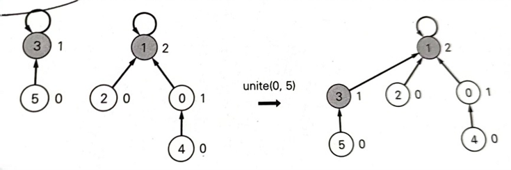
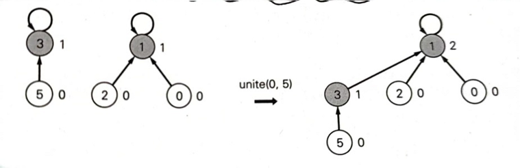

# 声明

本文档中的算法题目主要来源于本人的LeetCode每日签到题以及灵神提供的题单

算法的主要思路参考于下面三个来源：

- 挑战程序设计竞赛：算法和数据结构(渡部有隆)

- labuladong(**收费**)：https://labuladong.online/algo/

- 灵茶山艾府(**免费**)：https://leetcode.cn/u/endlesscheng/


# 字典树

## 题单


# 单调栈

单调栈可以分为单调递增栈以及单调递减栈。对于前者而言，


## 题单


# 大/小根堆

大/小根堆与C++中的优先队列是同一个概念。对于大根堆而言，堆的顶部是数组的最大值。而C++中的优先队列默认与大根堆一致，值大的处于队列前端。

下面介绍一些C++中如何使用优先队列

```C++
// 使用默认的优先队列
// 默认使用大根堆
priority_queue<int> pq;
// 与上面的等效
//第一个参数的含义是要存储的类型，第二个参数的含义是用vector进行实现， 第三个参数则是定义大根堆还是小根堆
priority_queue<int, vector<int>, less<int>> pq;
// 小根堆
priority_queue<int, vector<int>, greater<int>> pq;

// 加入元素到优先队列中
pq.push();
// 取队列首个元素，只有这个操作与队列不一样，队列是q.front()
pq.top();
// 元素出队列
pq.pop();

// 如果想要自定义优先队列里的元素，比如pair<int, int>
priority_queue<pair<int, int>, vector<pair<int, int>>, greater<pair<int, int>>> pq;
    
// 那么优先队列（最大堆）中是这么排序的，先按照pair中的第一个元素从大到小排列。对于第一个元素相等的那些pair，则根据第二个元素从大到小进行排列
```


## 题单


# 滑动窗口

滑动窗口适用于具有**单调性质**的题目。这里的单调性并不是指**狭义的单调性，即数组是非递减（非递增）的**。**滑动窗口所谓的单调性是指当数组长度越大，越能满足题目要求的条件（广义单调性）**。下面对这个单调性举例说明。


****

**题目：**给定一个target以及一个数组，要求找到长度最小的连续子数组，其和>=target。

**输入：**`target=7, nums[2,3,1,2,4,3]`

**输出：**`2`，`[4,3]`是满足条件的最小连续子数组

**解释：**很显然这个数组不是单调递增的。但是其具有广义单调性，即滑动窗口长度越长，其窗口内的和越能满足题目中>=target的要求。

****


滑动窗口的优势是需要过一遍整个数组（时间复杂度为$O(n)$），而不需要暴力搜索（时间复杂度为$O(n^2)$）。如果看到**题目要求找连续子数组并且与最小相关，那么这道题大概率可以用滑动窗口进行求解。**


注意，滑动窗口也可以称之为双指针。因此可以如下定义：变长滑动窗口为双指针，定长滑动窗口为滑动窗口（个人习惯问题，也可以统称为滑动窗口）。 


**实现代码：**

```C++
// 初始化条件
...

// 扩大窗口右边界
for(int right=0;right<n;right++){
    // 修改右边界对应的值
    ...
    
    // 收缩左窗口
	while(left<=right&&){
		// 修改左边界对应的值
        ...
        // 收缩左窗口
        left++;
    }
}

```


## 题单

| 题目                                                         | 难度 |
| ------------------------------------------------------------ | ---- |
| [825.适龄的朋友](https://leetcode.cn/problems/friends-of-appropriate-ages/description/) | 中等 |
| [632.最下区间](https://leetcode.cn/problems/smallest-range-covering-elements-from-k-lists/description/) | 困难 |
| [3206. 交替组 I](https://leetcode.cn/problems/alternating-groups-i/) | 简单 |
| [3208. 交替组 II](https://leetcode.cn/problems/alternating-groups-ii/) | 中等 |


# 单调滑动窗口

**实现代码：**

## 题单


# 并查集

两个很强大的优化：

**启发式合并：**利用rank数组来存储每颗树的秩(可以简单理解为树的高度)，每次合并时将高度较小的树合并到高度较大的树，保证合并后树的高度不会增加。有时候这可以不用，**有可能会出现死循环的情况**？





**路径压缩：**在进行findSet操作时，将路径上的所有节点都指向该集合的代表元素(**集合只考虑这个集合内有什么元素，路径是无关紧要的**，因此可以进行路径压缩)。这样的操作能够减少每棵树的高度。


**代码实现：**

```C++
class DisjointSet{
    vector<int> rank, p;
    
    DisjointSet(){}
    
    DisjointSet(int size){
        rank.resize(size, 0);
        p.resize(size ,0);
        for(int x=0;x<size;x++){
            makeSet(x);
        }
	}
    	
    // 初始化，自己的父亲指向自己
    void makeSet(int x){
        p[x]=x;
	}
    
    // 判断是否属于同一个集合
    bool same(int x, int y){
		return findSet(x)==findSet(y);
    }
    
    // 启发式合并
    // 将代表元素进行link
    void unite_optim(int x, int y){
        linke(findSet(x), findSet(y));
	}
    
    // 启发式合并，rank小的合并到rank大的中
    void link(int x, int y){
        if(rank[x]>rank[y]){
            p[y]=x;
        }
        else{
            p[x]=y;
            if(rank[x]==rank[y]){
				rank[y]++;
            }
        }
    }
    
    // 非启发式合并
    void unite(int x, int y){
        p[findSet(x)]=findSet(y);
    }
    
    
    // 带有路径压缩的查找集合代表元素
    int findSet(int x){
        if(p[x]!=x){
            p[x]=findSet(p[x]);
        }
        
        return p[x];
	}
};
```


## 题单

| 题目                                                         | 难度 |
| ------------------------------------------------------------ | ---- |
| [684.冗余连接](https://leetcode.cn/problems/redundant-connection/) | 中等 |
| [685.冗余连接 II](https://leetcode.cn/problems/redundant-connection-ii/description/) | 困难 |
| [3244.新增道路查询后的最短距离 II](https://leetcode.cn/problems/shortest-distance-after-road-addition-queries-ii/) | 困难 |


# 线段树

## 题单


# 二分查找

二分查找的写法有很多种，比如左闭右闭，左开右开等等。就个人偏好而言最喜欢**左闭右闭**写法，其余写法也是类似。


## 寻找某个数

**算法代码：**

```C++
int binary_search(int left, int right, vector<int>& nums, int target){
    while(left<=right){
        int mid=left+(right-left)/2;
        if(nums[mid]==target){
            return mid;
        }
        else if(nums[mid]>target){
            right=mid-1;
        }
        else if(nums[mid]<target){
            left=mid+1;
        }
    }
    
    return -1;
}
```


**一些细节：**

1. 为什么`while`循环中是`≤`？

   这和左右端点`left`和`right`的初始化有关。在这段代码中，`left=0,right=n-1`，即左闭右闭。**这个区间就是下次需要继续搜索的区间**。当**搜索区间为空**时循环终止，此时`left==right+1`，区间`[right+1,right]`为空。若不取等号，搜索区间为空时`left=right`，此时区间为`[right,right]`，`right`这个位置还没有被搜索，而该位置可能是正确的答案。
   
2. 为什么当```nums[mid]>target```时，是```right=mid-1```?

   这个问题同样和**搜索区间**这个概念挂钩。当`nums[mid]>target`，**由于找到的位置`mid`太小，需要进入右半区间进行搜索**。而对于`mid`而言，这个位置**已经搜索过了**，如果更新为`right=mid`，那么`mid`这个位置后续还会被搜索一次。因此，需要更新为`right=mid-1`，将`mid`从搜索区间中去除。对于`nums[mid]<target`同理。


## 寻找左侧边界

寻找左侧边界的含义是，对于`nums=[1,2,2,2,3]`的这样**存在重复元素**的数组，我希望找到数组中值为`target`的最左侧元素的下标。一种直观的的做法是先找到某个`target`的位置后往左侧进行线性搜索，**遗憾的是这样的做法时间复杂度不满足`O(logn)`**。


**算法代码：**

```C++
int left_bound(int left, int right, vector<int>& nums, int target){
    while(left<=right){
        int mid=left+(right-left)/2;
        // 收缩搜索区间的上界
        if(nums[mid]==target){
            right=mid-1;
        }
        else if(nums[mid]>target){
            right=mid-1;
        }
        else if(nums[mid]<target){
            left=mid+1;
        }
    }
    
    return left;
}
```


1. 当target不存在时，返回结果的含义是什么？
   **如果target不存在，搜索左侧边界的二分搜索返回的索引是大于target的最小索引**。具体而言，`nums=[2,3,5,7],target=4`，`left_bound`函数返回值为`2`，即对应元素`5`为大于`target`的第一个元素。因此`left_bound`函数可以用于**找到小于target的最大元素的索引**。应用到`nums=[2,3,5,7],target=4`这个例子中，函数`floor`应该返回`1`，因为其对应的元素`3`是第一个小于`target`的元素。

   ```C++
   int floor(vector<int> nums, int target){
       return left_bound(nums, target) - 1;
   }
   ```

   

2. 为什么这个算法能够找到左侧边界？
   关键在于当`nums[mid]==target`这个判断语句中，**当找到target时不要立即返回，而是缩小搜索区间的上界`right`**。这就能在区间`[left,mid-1]`中继续搜索，也即不断向左收缩，达到锁定左侧边界的目的。

3. 为什么`while`循环结束时，返回的是`left`？

   这一点与**循环不变量**这个概念相关，后续再补充这个概念。目前可以简单的记忆为因为寻找的是左侧边界，所以返回的是`left`。
   
4. 如果找不到想返回-1怎么办?
   只需要在最后返回结果时，特判一下即可。

   ```C++
   // 二分查找的while循环
   
   //判断左指针是否越界
   if(left<0 || left>=n){
       return -1;
   }
   
   // 判断最终找到的位置是否等于target
   return nums[left]==target?left:-1;
   
   ```
   
   


## 寻找右侧边界

与**寻找左侧边界**同理，这是寻找最右侧元素的下标。


**算法代码：**

```c++
int left_bound(int left, int right, vector<int>& nums, int target){
    while(left<=right){
        int mid=left+(right-left)/2;
        // 收缩搜索区间下边界
        if(nums[mid]==target){
            left=mid+1;
        }
        else if(nums[mid]>target){
            right=mid-1;
        }
        else if(nums[mid]<target){
            left=mid+1;
        }
    }
    
    //return left-1,在左闭右闭的情况下是等效的
    return right;
}
```


1. 当target不存在时，返回结果的含义是什么？
   恰好与寻找左侧边界相反，**如果target不存在，搜索右侧边界的二分搜索返回的索引是小于target的最大索引**。
2. 为什么返回的是`left-1`，而不是像寻找左侧边界一样返回`left`？
   因为对于left的更新是`left=mid+1`，即当`while`循环结束时，`nums[left]`一定不是右侧边界了，而`nums[left-1]`可能是右侧边界(因为存在target不存在的情况)。可以结合下面这张图思考
   


## C++中自带的库函数

**以下库函数均需要对有序(非降序)容器进行操作**

**lower_bound函数：**返回指向第一个值不小于val的迭代器位置，也即返回第一个大于等于val的位置。其中`first`和`last`用于指定要查找区间的起始和结束，类型为`迭代器`。value为要查找的值。

```C++
template< class ForwardIt, class T >
ForwardIt lower_bound( ForwardIt first, ForwardIt last, const T& value );
```


**upper_bound函数：**返回第一个大于val的位置。

```C++
template< class ForwardIt, class T >
ForwardIt upper_bound( ForwardIt first, ForwardIt last, const T& value );
```


## 题单

| 题目                                                         | 难度 |
| ------------------------------------------------------------ | ---- |
| [825.适龄的朋友](https://leetcode.cn/problems/friends-of-appropriate-ages/description/) | 中等 |
|                                                              |      |
|                                                              |      |


# 树状数组

**算法代码：**

```C++
int get_lowbit(int x){
    return x&(-x)
}

int query(){
    
}

int add(){
}
```


## 题单


# 查询

查询的含义是给定一个queries数组，其中**每个元素是一个询问**，要求对每一个询问回答一次。可以分为离线查询和在线查询两种

- 离线查询：知道所有的query，可以按照自己定义的某种顺序回答询问。而不是按输入顺序 *queries*[0],*queries*[1]这样回答。因此能够进行优化。
- 在线查询：只知道当前的query而不知道后面的query，没有办法做优化


## 题单

| 题目                                                         | 难度 |
| ------------------------------------------------------------ | ---- |
| [2940. 找到 Alice 和 Bob 可以相遇的建筑 ](https://leetcode.cn/problems/find-building-where-alice-and-bob-can-meet) | 困难 |
| [3261. 统计满足 K 约束的子字符串数量 II](https://leetcode.cn/problems/count-substrings-that-satisfy-k-constraint-ii/) | 困难 |
|                                                              |      |


# 前缀和

## 一维前缀和

一维前缀和的目的是为了能够快速查询区间和，给点一个区间的左端点`left`和`right`，能够在$O(1)$的时间复杂度内获得结果。对于一维前缀和有两种实现方式：

1. 需要单独处理`left=0`的情况
2. 不需要单独处理`left=0`的情况

实现的区别在于对前缀和数组的定义上，本质上无差别，请根据个人喜爱选择适合的方法。先对符号进行定义，原来的数组为`nums`，数组大小为`n`，前缀和数组为`sum`。


**第一种情况的实现：**

`sum[i]`定义为**nums[0]~nums[i]**之和，即$sum[i]=\sum_{j=0}^inums[j]$。此时数组`nums`和数组`sum`的大小一样。

- 当`left!=0`时，区间和的计算为`sum[right]-sum[left-1]`，即利用`[0,right]`的和减去`[0,left-1]`的和。通过这个计算公式我们也可以看到，当`left=0`时数组会出现越界的情况。
- 如果`left=0`，我们要求的是`[0,right]`的和，此时这正符合我们对前缀和数组的定义，因此直接返回`sum[right]`即可。

```C++
// 初始化前缀和数组
sum[0]=nums[0]
for(int i=1;i<n;i++){
	sum[i]=sum[i-1]+nums[i];
}

// 查询操作
if(left==0){
    return sum[right];
}
else{
    return sum[right]-sum[left-1];
}
```


**第二种情况的实现：**

`sum[i]`定义为**nums[0]~nums[i-1]**之和，即$sum[i]=\sum_{j=0}^{i-1}nums[j]$。因此在实现时为数组`sum`的大小要比数组`nums`**大1**。

初始状态下，定义`sum[0]=0`。这样的定义相当于`sum[0]`为一个**哨兵**，在计算`[left,right]`区间和时，直接返回`sum[right+1]-sum[left]`即可：

- 若`left!=0`，`sum[left]`存储的是**nums[0]~nums[left-1]**的和，`sum[right+1]`存储的是**nums[0]~nums[right]**的和。可以直接返回`sum[right+1]-sum[left]`
- 若`left==0`，由于`sum[left]=sum[0]=0`，减去0对结果无影响。同样可以直接返回`sum[right+1]-sum[left]`

```C++
// 初始化不同
sum[0]=0
for(int i=0;i<n;i++){
	sum[i+1]=sum[i]+nums[i];
}

// 查询操作也不同
return sum[right+1]-sum[left];
```


## 二维前缀和

和**容斥原理**有相似的原理，


## 前缀和与树状数组的关系

前缀和只适用于**查询**操作，如果还需要增加**修改**操作，这时候就需要用到**树状数组**。


## 题单

| 题目                                                         | 难度 |
| ------------------------------------------------------------ | ---- |
| [661.图片平滑器](https://leetcode.cn/problems/image-smoother/description/) | 简单 |
|                                                              |      |
|                                                              |      |


# 差分数组

## 题单


# 最小生成树

## 题单


# 最短路径

## 单源最短路径

**bfs算法：**广度优先搜索算法显然可以找到最短路径。从起点出发，每次往外围扩散一层，第一次到达目标节点时，一定是最快到达的。该种算法应用于无权图，或者题目和时间挂钩(也即每走一步时间+1)。

```C++
int bfs(vector<vector<int>>& g, int n, int target){
    // 访问数组
    vector<bool> vis(n, false);
    
    // 前者记录节点编号，后者记录当前节点距离起点的距离
    queue<pair<int, int>> q;
    q.push(pair<int, int>(0, 0));
    
    while(!q.empty()){
     	// 弹出队首元素
        pair<int, int> p=q.front();
        int u=p.first, dis=p.second;
        q.pop();
		
        // 找到目标节点
        if(u==n-1){
            return dis;
        }
		
        // 以当前节点为起点，寻找下一层可到达的节点
        for(auto v: g[u]){
            // 首要条件是之前没有访问过
            if(vis[v]==false){
                // 距离+1
                q.push(pair<int,int>(v, dis+1));
               	// 标记为访问过
                vis[v]=true;
            }
        }
    }
}
```


**dijkstra算法：**该算法的主要思路是**每次通过找到当前距离最小的点，希望通过这点去更新到其他点的距离，达到局部最优**。具体属于贪心还是动态规划，有待商榷。相比于使用**bfs算法**来查找最短路径，这个算法应用于带权图。该算法**不可以应用于包含负权值**的图。具有负权值的图可以套用贝尔曼-福特算法或者弗洛伊德算法来处理。**该算法存在变种**，可以使用一个前驱数组来记录当前最短路径的前驱，以找到所有最短路径。

```C++
// s:source, t:target, n:总节点数目, g:图
void dijkstra(int s, int t, int n, vector<vector<int>>& g){
    //d[i]：节点0到节点i的最短距离
    vector<int> d(n, 0x3f3f3f3f);
    vector<bool> vis(n, false);
    
    d[s]=0;
    // 死循环
    while(1){
        int minv=0x3f3f3f3f;
        int u=-1;
        // 从未访问过的节点中，选出距离最短的
        for(int i=0;i<n;i++){
            if(minv>d[i]&&vis[i]==false){
                minv=d[i];
                u=i;
            }
        }
        
        // 没有找到这样的节点，说明算法已经收敛(无法再进行更新)
        if(u==-1){
            break;
        }
        
        vis[u]=true;
        for(int v=0;v<n;v++){
            // 如果没有访问过，且这两点可达
            if(vis[v]==false&&g[u][v]!=-1){
                // 如果通过节点u到达v距离更小，更新
                if(d[u]+g[u][v]<d[v]){
					d[v]=d[u]+g[u][v];
                }
            }
        }
    }
}
```


**dijkstra算法优化：**可以使用

```C++
```


## 多源最短路径

多源最短路径使用floyd算法，其本质是动态规划（**思路详解后续再补充**）。大致思路判断能否通过一个中间节点`k`，缩短节点`u`和节点`v`之间的距离。该算法的功能是**能够判断图中是否存在负环**。算法结束后，如果图中的某个顶点`v`到自身的最短距离为负值，说明图中存在负环。时间复杂度为$O(V^3)$，因为算法中包含了三重循环。


```C++
// 初始化图，无法达到定义为0x3f3f3f3f(即int上限，也可以根据需求改成long long的上限)
// 自身到自身要定义为不可到达

for(int k=0;k<n;k++){
    for(int i=0;i<n;i++){
        if(g[i][k]==0x3f3f3f3f){
            continue;
        }
        for(int j=0;j<n;j++){
            if(g[k][j]==0x3f3f3f3f){
                continue;
            }
            g[i][j]=min(g[i][j], g[i][k]+g[k][j])
        }
    }
}
```


## 题单

| 题目                                                         | 备注      | 难度 |
| ------------------------------------------------------------ | --------- | ---- |
| [3243.新增道路查询后的最短路径Ⅰ](https://leetcode.cn/problems/shortest-distance-after-road-addition-queries-i/description/) | 单源      | 中等 |
| [743.网络延迟时间](https://leetcode.cn/problems/network-delay-time/description/) | 单源/多源 | 中等 |
|                                                              |           |      |


# 脑筋急转弯类

这类题目过于灵活，没有统一套路，只给出题单

| 题目                                                         | 难度 |
| ------------------------------------------------------------ | ---- |
| [3240.最少翻转次数使二进制矩阵回文Ⅱ](https://leetcode.cn/problems/minimum-number-of-flips-to-make-binary-grid-palindromic-ii/description/) | 中等 |
| [3001. 捕获黑皇后需要的最少移动次数](https://leetcode.cn/problems/minimum-moves-to-capture-the-queen/) | 中等 |
|                                                              |      |


# 回溯

回溯的想法和动态规划一样，即**选与不选**和**枚举选哪个**。


# 动态规划

动态规划主要可以分为两种类型，**选与不选**以及**枚举选哪个**。实现可以有**记忆化搜索**（自低向上）和**递推**（自顶向下）两种，其本质一样，**重点还是在于思考如何进行定义状态以及状态之间的转移**。不过对于后者，能够在空间和时间上得到进一步优化，而前者不行。下面将首先介绍记忆化搜索的写法，更**便于理解**。后面将介绍如何将记忆化搜索翻译到递推。

此外动态规划还有区分从左边思考，还是从右边思考的问题。一般来说，从右边思考会更好，原因如下：1.在记忆化搜索调用`dfs`函数时不用传入数组大小，只需要判断当前位置是否为0，即到终止边界。2.更容易将记忆化搜索转化为递推。


此外有些题目两种类型都可以解决，但是时间复杂度不一样。如果用了不合适的类型来解，可能会出现超时。


## 选与不选的经典例题


**LeetCode198.打家劫舍**

****

**题目：**给定一个非负整数数组，在不选择相邻元素的情况下，所选元素和最大为多少？

**输入：**` nums=[2,7,9,3,1]`

**输出：**`12`，即`2+9+1`

**解释：**

- 考虑从哪里开始思考？应该从数组的左右两端开始思考，因为对于**左右两端限制最少**，很好入手，这也是dp问题一般的套路。
- 先从回溯的角度来思考，这题的搜索应该对应一个子集树，即选与不选问题。**从右到左**思考，考虑`1`这个元素是否选择，如果选那么问题就变为对于`[2,7,9]`能够获得的最大元素和（因为不能相邻，选择了1就一定不能选择3）。如果不选，那么问题就变为对于`[2,7,9,1]`能够获得的最大元素和。因此可以做如下定义：dfs(i)为前i个元素能够获得的最大元素和，dfs(i)=max(dfs(i-1),dfs(i-2)+nums[i])，这个式子仅仅是对前面解释的翻译。

```C++
// 传引用，否则会超时
int dfs(int i, vector<int>& nums){
    // 递归边界，前(负数)个元素，得到的和一定为0，即不存在这样的元素和
	if(i<0){
		return 0;
    }
    
    int res=max(dfs(i-1), dfs(i-2)+nums[i]);
    return res;
}

return dfs(n, nums);
```

- 但是对于回溯过程，其时间复杂度是指数级别。其搜索树如下所示，可以看到其中存在重复计算的节点比如节点2和1。因此可以使用一个**备忘录**来存储各个状态的结果，**保证在下次搜索到这个状态时，能够直接返回结果而不是继续往下递归，即剪枝**。这也就是记忆化搜索的名字由来。


- 修改后的代码和搜索树如下所示

```C++
// 传引用，否则会超时
int dfs(int i, vector<int>& nums, vector<int>& memo){
    // 递归边界，前(负数)个元素，得到的和一定为0，即不存在这样的元素和
	if(i<0){
		return 0;
    }
    
    // 如果被搜索过了，直接返回
    if(memo[i]!=-1){
        return memo[i];
    }
    
    // 引用，后续可以不用手动修改备忘录
    int& res=memo[i];
    res=max(dfs(i-1), dfs(i-2)+nums[i]);
    
    return res;
}

// 在dfs函数中有多少个状态参数，备忘录就要多少个维度。比如这题中只有i这个参数，因此备忘录维度为1
// 初始化要为不可能取得的值，能够代表该状态还没有被搜索过
vector<int> memo(n, -1);
// 从最后一个房子开始考虑
return dfs(n-1, nums, memo);

```


****


## 枚举选哪个的经典例题


****


****


## 从记忆化搜索到递推

- 在记忆化搜索中，`dfs`有几个参数就创建几维的`dp`数组。这与记忆化数组一样。
- 记忆化搜索的终点，就是`dp`数组的初始值
- 剩余操作基本就是将dfs(x1, x2)改成dp\[x1][x2]（**具体如何操作还是要靠自己刷题**）


这里同样以上述的打家劫舍为例子，

****

```C++
// 创建dp数组，对应第一点。但是需要注意的是
vector<int> dp()

// 初始化dp数组，对应第二点

    
// 记忆化搜索翻译成递推
for()
```


同时，我们还可以发现，对于计算当前状态`i`的值只需要用到前面两个状态`i-1`和`i-2`的值，因此可以进一步做出空间优化。将上面代码中$O(n)$的dp数组优化成$O(1)$的变量。**这种依赖于状态计算的想法适用于动态规划中的任何空间优化问题上，比如01背包同样适用。**因此优化后的代码如下：

```C++

```


****


## 数位dp


## 时间复杂度

- 记忆化搜索：状态个数×单个状态的记忆个数。状态个数即递归调用的参数范围，单个状态的计算时间为一层调用中的for循环次数。更加具体的分析可以自行搜索**递归树**。
- 递推：与for循环层数有关


## 题单

| 题目                                                         | 类型       | 难度 |
| ------------------------------------------------------------ | ---------- | ---- |
| [3250. 单调数组对的数目 I](https://leetcode.cn/problems/find-the-count-of-monotonic-pairs-i/) | 枚举选哪个 | 困难 |
| [3251. 单调数组对的数目 II](https://leetcode.cn/problems/find-the-count-of-monotonic-pairs-ii/) | 枚举选哪个 | 困难 |
| [688. 骑士在棋盘上的概率](https://leetcode.cn/problems/knight-probability-in-chessboard/) | 枚举选哪个 | 中等 |
| [935. 骑士拨号器](https://leetcode.cn/problems/knight-dialer/) | 枚举选哪个 | 中等 |


# 快速幂

快速幂的本质是分治法，即将问题对半划分为两个子问题。因此时间复杂度为$O(logn)$。

对于递归写法而言，若要计算$x^n$：

- 若$n$是偶数，那么$x^n=(x^{n/2})^2$

- 若$n$是奇数，那么$x^n=x×x^{n-1}=x×(x^{(n-1)/2})^2$。**因为n为奇数，所以n-1为偶数**

```C++
long long fastPow(long long x, int n){
    // 任何数的0次幂都为1
    if(n==0){
        return 1;
    }
    
    // 计算x^(n/2)，由于当n为奇数时，/2操作向下取证，因此偶数和奇数可以统一写法
    long long half=fastPow(x, n/2);
    
    return n%2==0?half*half:x*half*half;
}
```


对于非递归写法而言，若要计算$x^n$:

- 以$x^8$为例，其可以由$x \rightarrow x^2 \rightarrow x^4 \rightarrow x^8$，即不断对$x$自身进行平方，重复三次得到结果
- 以$x^{15}$为例，其可以由$x \rightarrow x^2 \rightarrow x^4 \rightarrow x^8$，将整个过程的所有幂次相乘得到最终结果
- 以$x^{13}$为例，其可以由$x \rightarrow x^4 \rightarrow x^8$，将整个过程的所有幂次相乘得到最终结果
- 因此问题关键在于如何将幂次进行拆分，将幂次转换为二进制`15=1111`，`13=1101`，可以发现要相乘的结果刚好与二进制中1的位置相对应。

```C++
// 计算x^N
double fastPow(double x, int N){
    double ans=1;
    long long n=N;
    
    // 特判n<0的情况，x^n=(1/x)^(-n)
    if(n<0){
        n=-n;
        x=1/x;
    }
    
    while(n){
        // 如果n的最低位为1
        if(n&1){
            ans*=x;
        }
        // 自身平方
        x*=x;
        // n右移，枚举下一位
        n >>= 1;
    }
    
    return ans;
}
```


# 贪心


## 反悔贪心


## 题单

| 题目                                                         | 难度 |
| ------------------------------------------------------------ | ---- |
| [2931. 购买物品的最大开销](https://leetcode.cn/problems/maximum-spending-after-buying-items/) | 困难 |
| [1338. 数组大小减半](https://leetcode.cn/problems/reduce-array-size-to-the-half/) | 中等 |
|                                                              |      |


# 数论


## 素数相关

**一般算法：**即只要遍历sqrt(n)的一半即可，因为因子是关于sqrt(n)左右对称的

```C++
// 不用sqrt是防止精度损失
for(int i=2;i*i<=n;i++){
    if(n%i==0){
        return false;
    }
}

return true;
```


**素数筛：**进一步优化，从小素数开始筛出合数。1.先找到数组中第一个未被标记的数，初始为2（0和1一定不是素数）。2.标记这个素数的所有**倍数**均为**非素数**。3.回到第一步，直到筛选到上限。时间复杂度为O(nloglogn)。

```C++
vector<bool> isPrime(n + 1, true); // 创建一个布尔数组，初始时假设所有数都是素数
isPrime[0] = isPrime[1] = false;  // 0 和 1 不是素数

for (int i = 2; i * i <= n; ++i) {
    if (isPrime[i]) { // 如果 i 是素数
        // 这里是从i*i开始，而不是2*i。因为2*i一定被前面的数字标记过了
        for (int j = i * i; j <= n; j += i) {
            isPrime[j] = false; // 标记 i 的倍数为非素数
        }
    }
}
```


**素数筛还可以拓展到前缀和的版本**，即统计[0,i]之间有多少个素数，可以很方便的用于区间查询。

```C++
vector<int> pi(MX+1)

for(int i=2;i<=MX;i++){
    // 当前数是素数
    if(pi[i]==0){
        // 将i标记为素数
        pi[i]=pi[i-1]+1;
        for(int j=i*i;j<=MX;j+=i){
            // 将j标记为合数,在后面会进入else分支
            pi[j]=-1;
        }
    }
    else{
        // 将i标记为合数
        pi[i]=pi[i-1];
    }
}
```


**线性筛：**对素数筛的再进一步优化，


## 题单

| 题目                                                         | 类型     | 难度 |
| ------------------------------------------------------------ | -------- | ---- |
| [3233. 统计不是特殊数字的数字数量](https://leetcode.cn/problems/find-the-count-of-numbers-which-are-not-special/) | 素数相关 | 中等 |
|                                                              |          |      |
|                                                              |          |      |


# 位运算

位运算可以看作是集合上的操作
